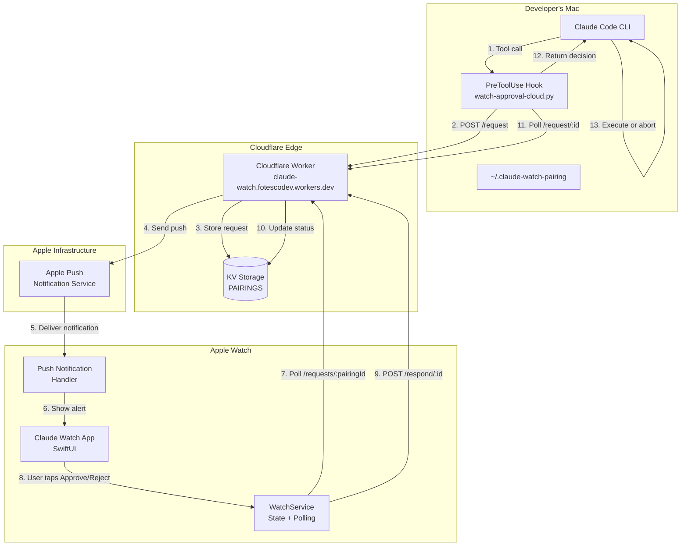
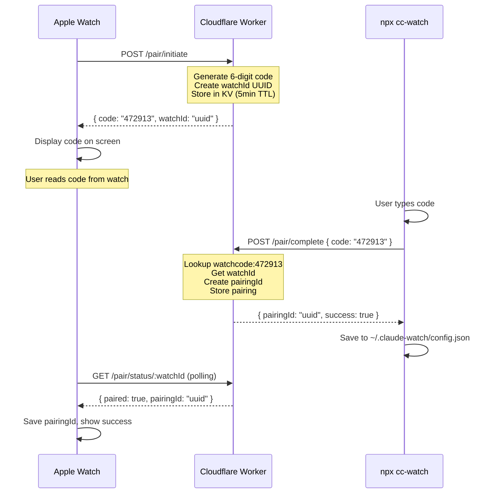
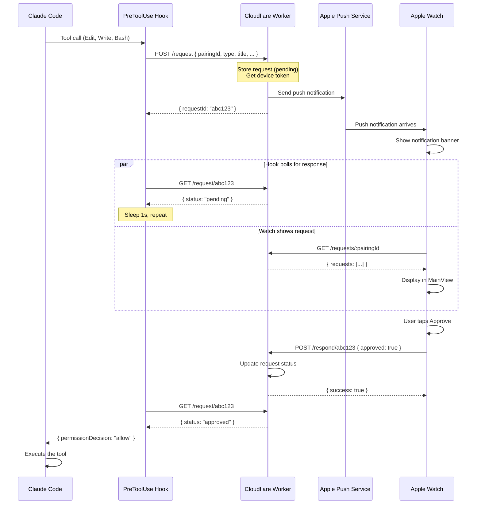

# Claude Watch - Architecture & System Documentation

> **Problem Solved**: Remote approval/rejection of Claude Code actions from Apple Watch
> **Date**: 2026-01-18
> **Status**: Production Ready

## Overview

Claude Watch enables developers to approve or reject Claude Code permission requests from their Apple Watch, even while away from their computer. The system uses a cloud relay architecture with push notifications for real-time alerts.

**Key Achievement**: Walk your dog while controlling Claude Code from your wrist.

---

## System Architecture



---

## Data Flow Diagrams

### Pairing Flow (Watch Shows Code)



### Approval Flow (Remote Control)



---

## Component Reference

### 1. Claude Code Hook (`watch-approval-cloud.py`)

**Location**: `.claude/hooks/watch-approval-cloud.py`

**Purpose**: Intercepts tool calls and routes them to watch for approval.

**Trigger**: PreToolUse hook for `Bash|Write|Edit|MultiEdit`

**Flow**:
1. Receives tool call JSON from Claude Code
2. Creates request on cloud server
3. Sends simulator notification (dev only)
4. Polls for response (5 min timeout)
5. Returns `permissionDecision: allow/deny`

**Configuration**:
- `CLAUDE_WATCH_PAIRING_ID` env var, OR
- `~/.claude-watch-pairing` file

### 2. Cloudflare Worker (`MCPServer/worker/`)

**URL**: `https://claude-watch.fotescodev.workers.dev`

**Endpoints**:

| Method | Path | Description |
|--------|------|-------------|
| POST | `/pair/initiate` | Watch requests pairing code |
| GET | `/pair/status/:watchId` | Watch polls for pairing completion |
| POST | `/pair/complete` | CLI completes pairing with code |
| POST | `/request` | Hook creates approval request |
| GET | `/request/:id` | Hook polls for response |
| GET | `/requests/:pairingId` | Watch fetches pending requests |
| POST | `/respond/:id` | Watch submits approval/rejection |
| GET | `/state` | Health check |

**Storage**: Cloudflare KV (`PAIRINGS` namespace)

**APNs Integration**: Uses `@anthropic/apns` for push notifications

### 3. watchOS App (`ClaudeWatch/`)

**Structure**:
```
ClaudeWatch/
├── App/
│   └── ClaudeWatchApp.swift      # Entry point, notification setup
├── Views/
│   ├── MainView.swift            # Primary UI, action display
│   ├── PairingView.swift         # Pairing flow UI
│   └── ActionViews.swift         # Approve/reject buttons
├── Services/
│   └── WatchService.swift        # State, polling, API calls
└── Complications/
    └── ComplicationViews.swift   # Watch face widgets
```

**Key Classes**:

- **WatchService**: Singleton managing state, cloud communication, polling
- **PendingAction**: Model for approval requests
- **AppState**: Observable state container

### 4. CLI Tool (`npx cc-watch`)

**Package**: `@anthropic/cc-watch` (npm)

**Purpose**: Pairs Mac with watch, manages configuration

**Commands**:
- `npx cc-watch` - Interactive pairing (enter code from watch)
- Saves config to `~/.claude-watch/config.json`

---

## API Reference

### POST /pair/initiate

Watch requests a pairing code to display.

**Request**:
```json
{
  "deviceToken": "apns-token-hex-string"  // Optional
}
```

**Response**:
```json
{
  "code": "472913",
  "watchId": "uuid",
  "expiresIn": 600
}
```

### POST /pair/complete

CLI completes pairing by submitting the code.

**Request**:
```json
{
  "code": "472913",
  "deviceToken": "apns-token"  // Optional, for CLI notifications
}
```

**Response**:
```json
{
  "success": true,
  "pairingId": "uuid"
}
```

### POST /request

Create an approval request.

**Request**:
```json
{
  "pairingId": "uuid",
  "type": "file_edit",
  "title": "Edit: MainView.swift",
  "description": "'old' → 'new'",
  "filePath": "/path/to/file.swift",
  "command": null
}
```

**Response**:
```json
{
  "requestId": "abc123",
  "status": "pending"
}
```

### GET /request/:id

Poll for request status.

**Response**:
```json
{
  "id": "abc123",
  "status": "approved",  // "pending", "approved", "rejected"
  "pairingId": "uuid",
  "type": "file_edit",
  "title": "Edit: MainView.swift"
}
```

### POST /respond/:id

Watch submits approval decision.

**Request**:
```json
{
  "approved": true,
  "pairingId": "uuid"
}
```

**Response**:
```json
{
  "success": true,
  "status": "approved"
}
```

---

## Configuration Files

### `.claude/settings.json` (Hook Configuration)

```json
{
  "hooks": {
    "PreToolUse": [
      {
        "matcher": "Bash|Write|Edit|MultiEdit",
        "hooks": [
          {
            "type": "command",
            "command": "python3 \"$CLAUDE_PROJECT_DIR\"/.claude/hooks/watch-approval-cloud.py"
          }
        ]
      }
    ]
  }
}
```

**Important**: Remove `Edit` and `Write` from `permissions.allow` for hook to block.

### `~/.claude-watch/config.json` (Pairing Data)

```json
{
  "pairingId": "uuid",
  "cloudUrl": "https://claude-watch.fotescodev.workers.dev",
  "pairedAt": "2026-01-18T12:00:00Z"
}
```

### `~/.claude-watch-pairing` (Hook Config)

Simple text file containing just the pairing ID:
```
3d650e27-a8b2-435e-a408-7442bc3a8042
```

---

## Troubleshooting

### Hook not blocking edits

**Symptom**: Edits go through without watch approval

**Cause**: `Edit` and `Write` in `permissions.allow` list

**Fix**: Remove from `.claude/settings.json`:
```json
"allow": [
  "Read",
  // Remove "Write" and "Edit"
]
```

### Watch not receiving notifications

**Symptom**: Request created but no push notification

**Causes**:
1. Missing APNs device token
2. APNs credentials not configured in worker
3. App not registered for notifications

**Debug**:
```bash
# Check pending requests
curl https://claude-watch.fotescodev.workers.dev/requests/YOUR_PAIRING_ID
```

### Pairing ID mismatch

**Symptom**: 404 errors on requests

**Cause**: `~/.claude-watch-pairing` doesn't match `~/.claude-watch/config.json`

**Fix**:
```bash
jq -r .pairingId ~/.claude-watch/config.json > ~/.claude-watch-pairing
```

### Main view not updating live

**Symptom**: Notification arrives but MainView stays on "All Clear"

**Cause**: State updates not on MainActor

**Fix**: Wrap state updates in `await MainActor.run { }`

---

## Testing

### Simulator Testing

```bash
# Send test notification to simulator
xcrun simctl push "Apple Watch Series 9 (45mm)" com.edgeoftrust.claudewatch payload.json
```

### Manual Hook Test

```bash
echo '{"tool_name": "Edit", "tool_input": {"file_path": "/test.swift"}}' | \
  python3 .claude/hooks/watch-approval-cloud.py
```

### Check Cloud State

```bash
# Pending requests
curl https://claude-watch.fotescodev.workers.dev/requests/YOUR_PAIRING_ID

# Specific request status
curl https://claude-watch.fotescodev.workers.dev/request/REQUEST_ID
```

---

## Future Enhancements

- **FE1**: Real task progress tracking from Claude Code sessions
- **iOS Companion**: iPhone app for clipboard paste, extended UI
- **CarPlay**: In-car approval interface
- **Voice Commands**: "Hey Siri, approve Claude"
- **Complications**: Real-time status on watch face

---

## Key Learnings

1. **Pairing direction matters**: Watch shows code → CLI enters (not reverse)
2. **MainActor for UI**: All SwiftUI state updates must be on main thread
3. **Permission vs hooks**: Hooks run but don't block if permission pre-granted
4. **Polling as backup**: Push for speed, polling for reliability
5. **Fail-open design**: Hook errors allow action to proceed (dev-friendly)
